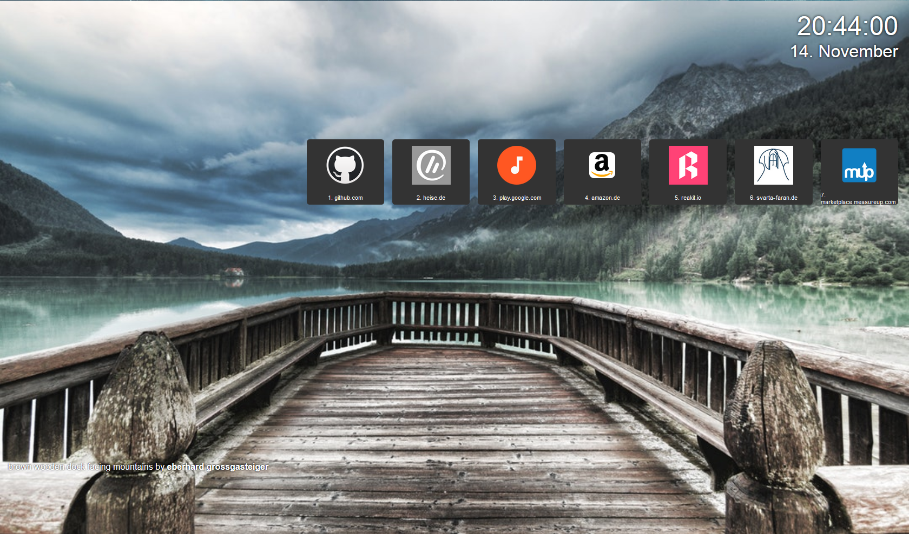

# nice newtab

I wanted a nice, clean start page, which had to satisfy my following desires:

1. Display a nice image acros the whole page
1. The image has to change often
1. The current time should be displayed (it's always a good idea to show the time)
1. ideally make it easy to access frequently visited pages

This project aims for exactly this satisfaction!

## the innerts

The project uses react to display the pages, maintaining its state with the help of redux
and the local storage.

Currently the images are provided by Unsplash, but I'm considering to use another api